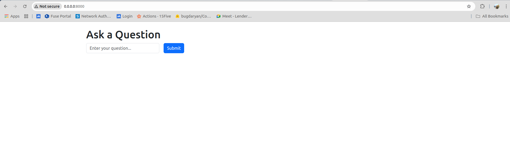
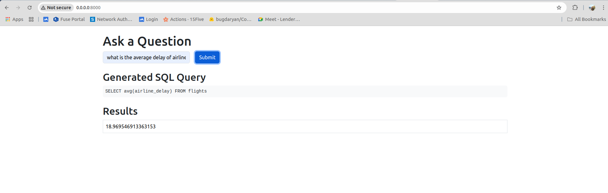

# Cosmofoil Project

This project is a Text to SQL application that uses a database from Kaggle.
Database link : (https://www.kaggle.com/datasets/usdot/flight-delays/data)
Follow the steps below to set up and run the project.

Befor running the project , download the data files from the above link.
## Getting Started

### Installation

1. **Clone the repository:**

    ```bash
    git clone https://github.com/yourusername/cosmofoil-project.git
    cd cosmofoil-project
    ```

2. **Create and activate a virtual environment:**

    ```bash
    python -m venv venv
    source venv/bin/activate  # On Windows use `venv\Scripts\activate`
    ```

3. **Install the required packages:**

    ```bash
    pip install -r requirements.txt
    ```

4. **Set up the database:**

    ```bash
    python database_setup.py
    ```

5. **Insert data into the database:**

    ```bash
    python insert_data.py
    ```

6. **Run the application:**

    ```bash
    python app.py
    ```

7. **Open the application in your browser:**

    Navigate to [http://0.0.0.0:8000](http://0.0.0.0:8000)

## Examples of UI
The UI is built with **FASTAPI** and **HTMLX**.

### Screenshots

- 
- 
- 

## Acknowledgements

- Database from [Kaggle](https://www.kaggle.com/)
